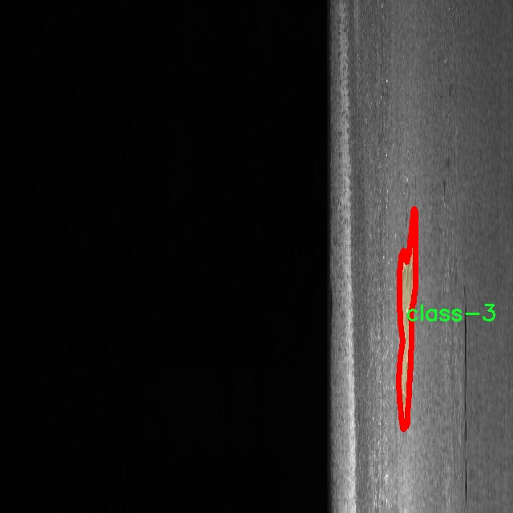

# 钢铁缺陷图像分割系统： yolov8-seg-rtdetr

### 1.研究背景与意义

[参考博客](https://gitee.com/YOLOv8_YOLOv11_Segmentation_Studio/projects)

[博客来源](https://kdocs.cn/l/cszuIiCKVNis)

研究背景与意义

随着工业自动化和智能制造的快速发展，钢铁行业面临着日益严峻的质量控制挑战。钢铁产品的质量直接影响到下游产业的安全性和可靠性，因此，及时、准确地检测和识别钢铁缺陷显得尤为重要。传统的人工检测方法不仅耗时耗力，而且容易受到人为因素的影响，导致检测结果的不稳定性和不准确性。为了解决这一问题，基于计算机视觉和深度学习的自动化缺陷检测技术逐渐成为研究的热点。

在众多深度学习模型中，YOLO（You Only Look Once）系列因其高效的实时目标检测能力而受到广泛关注。YOLOv8作为该系列的最新版本，结合了更先进的网络结构和算法优化，能够在保持高精度的同时实现更快的推理速度。然而，针对钢铁缺陷的具体应用场景，YOLOv8仍存在一些不足之处，例如对复杂背景的适应性不足、对小目标的检测能力有限等。因此，改进YOLOv8以适应钢铁缺陷图像分割的需求，具有重要的研究价值和实际意义。

本研究以“severstal-steel-defect-instance-segmentation”数据集为基础，包含6700幅钢铁缺陷图像，涵盖四类缺陷（class-1、class-2、class-3、class-4）。该数据集不仅提供了丰富的样本数据，还涵盖了多种类型的钢铁缺陷，为模型的训练和评估提供了良好的基础。通过对该数据集的深入分析，可以发现不同类型的缺陷在形态、颜色和纹理等方面存在显著差异，这为改进YOLOv8提供了有力的支持。

本研究的意义主要体现在以下几个方面：首先，通过改进YOLOv8的网络结构和训练策略，可以提高模型对钢铁缺陷的检测精度和分割能力，从而实现对钢铁产品质量的自动化监测。这不仅可以提高生产效率，降低人工成本，还能减少因缺陷产品造成的经济损失。其次，研究过程中所采用的图像分割技术，将为钢铁缺陷的定量分析提供新的思路和方法，有助于深入理解缺陷形成的机制，从而为后续的工艺改进提供科学依据。最后，本研究还将为相关领域的研究者提供一个可参考的模型和方法，推动钢铁缺陷检测技术的进一步发展。

综上所述，基于改进YOLOv8的钢铁缺陷图像分割系统的研究，不仅具有重要的理论意义，也具备广泛的应用前景。通过该研究，期望能够为钢铁行业的智能化转型提供有力的技术支持，推动行业的可持续发展。

### 2.图片演示


注意：本项目提供完整的训练源码数据集和训练教程,由于此博客编辑较早,暂不提供权重文件（best.pt）,需要按照6.训练教程进行训练后实现上图效果。

### 3.视频演示

[3.1 视频演示](https://www.bilibili.com/video/BV1KozSYxEi3/)

### 4.数据集信息

##### 4.1 数据集类别数＆类别名

nc: 4
names: ['class-1', 'class-2', 'class-3', 'class-4']


##### 4.2 数据集信息简介

数据集信息展示

在现代工业生产中，钢铁的质量直接影响到产品的性能和安全性。因此，及时发现和处理钢铁缺陷显得尤为重要。为此，我们使用了名为“severstal-steel-defect-instance-segmentation”的数据集，以训练和改进YOLOv8-seg的钢铁缺陷图像分割系统。该数据集专门针对钢铁表面缺陷进行了精心标注，旨在为机器学习模型提供高质量的训练数据，从而提高缺陷检测的准确性和效率。

该数据集包含四个主要类别，分别为“class-1”、“class-2”、“class-3”和“class-4”。每个类别代表一种特定类型的钢铁缺陷，这些缺陷可能会影响钢铁的使用性能和外观。具体而言，“class-1”可能代表了较为常见的表面划痕，而“class-2”则可能对应于更为复杂的缺陷，如气泡或夹杂物。“class-3”可能涉及到更严重的缺陷，例如裂纹，而“class-4”则可能包括其他类型的表面缺陷，如锈蚀或变色。通过对这些缺陷进行分类，我们能够为后续的图像分割和缺陷检测提供更为细致的指导。

数据集的构建过程非常严谨，确保了每个图像都经过专业人员的标注和审核。这不仅提高了数据的可靠性，也为模型的训练提供了坚实的基础。每个图像都包含了对应的缺陷区域标注，这些标注信息为YOLOv8-seg模型的训练提供了丰富的实例，使其能够在实际应用中更好地识别和分割钢铁表面的缺陷。

在训练过程中，YOLOv8-seg模型将利用这些标注数据进行学习，通过不断优化参数和调整网络结构，以提高其在钢铁缺陷检测中的表现。该模型不仅能够识别出缺陷的存在，还能够精确地分割出缺陷区域，从而为后续的自动化处理提供依据。这一过程的成功与否，直接依赖于数据集的质量和多样性。

此外，数据集的多样性也为模型的泛化能力提供了保障。通过包含不同类型和程度的缺陷图像，模型能够学习到更为丰富的特征，从而在面对新数据时，依然能够保持较高的检测准确率。这对于实际生产环境中的钢铁缺陷检测尤为重要，因为在真实场景中，缺陷的种类和表现形式可能会有所不同。

总之，“severstal-steel-defect-instance-segmentation”数据集为改进YOLOv8-seg的钢铁缺陷图像分割系统提供了坚实的基础。通过对四个类别的缺陷进行细致的标注和分类，该数据集不仅提高了模型的训练效果，也为钢铁行业的质量控制提供了强有力的技术支持。随着深度学习技术的不断发展，我们有理由相信，基于这一数据集训练出的模型将在钢铁缺陷检测领域发挥越来越重要的作用。




### 5.项目依赖环境部署教程（零基础手把手教学）

[5.1 环境部署教程链接（零基础手把手教学）](https://www.bilibili.com/video/BV1jG4Ve4E9t/?vd_source=bc9aec86d164b67a7004b996143742dc)


[5.2 安装Python虚拟环境创建和依赖库安装视频教程链接（零基础手把手教学）](https://www.bilibili.com/video/BV1nA4VeYEze/?vd_source=bc9aec86d164b67a7004b996143742dc)

### 6.手把手YOLOV8-seg训练视频教程（零基础手把手教学）

[6.1 手把手YOLOV8-seg训练视频教程（零基础小白有手就能学会）](https://www.bilibili.com/video/BV1cA4VeYETe/?vd_source=bc9aec86d164b67a7004b996143742dc)


按照上面的训练视频教程链接加载项目提供的数据集，运行train.py即可开始训练



     Epoch   gpu_mem       box       obj       cls    labels  img_size
     1/200     0G   0.01576   0.01955  0.007536        22      1280: 100%|██████████| 849/849 [14:42<00:00,  1.04s/it]
               Class     Images     Labels          P          R     mAP@.5 mAP@.5:.95: 100%|██████████| 213/213 [01:14<00:00,  2.87it/s]
                 all       3395      17314      0.994      0.957      0.0957      0.0843

     Epoch   gpu_mem       box       obj       cls    labels  img_size
     2/200     0G   0.01578   0.01923  0.007006        22      1280: 100%|██████████| 849/849 [14:44<00:00,  1.04s/it]
               Class     Images     Labels          P          R     mAP@.5 mAP@.5:.95: 100%|██████████| 213/213 [01:12<00:00,  2.95it/s]
                 all       3395      17314      0.996      0.956      0.0957      0.0845

     Epoch   gpu_mem       box       obj       cls    labels  img_size
     3/200     0G   0.01561    0.0191  0.006895        27      1280: 100%|██████████| 849/849 [10:56<00:00,  1.29it/s]
               Class     Images     Labels          P          R     mAP@.5 mAP@.5:.95: 100%|███████   | 187/213 [00:52<00:00,  4.04it/s]
                 all       3395      17314      0.996      0.957      0.0957      0.0845


### 7.50+种全套YOLOV8-seg创新点加载调参实验视频教程（一键加载写好的改进模型的配置文件）

[7.1 50+种全套YOLOV8-seg创新点加载调参实验视频教程（一键加载写好的改进模型的配置文件）](https://www.bilibili.com/video/BV1Hw4VePEXv/?vd_source=bc9aec86d164b67a7004b996143742dc)

### YOLOV8-seg算法简介

原始YOLOv8-seg算法原理

YOLOv8-seg是YOLO系列中的最新版本，专注于目标检测和分割任务。它的设计理念在于结合目标检测与图像分割的优点，提供更为精准的物体识别和轮廓提取能力。YOLOv8-seg在YOLOv8的基础上进行了改进，主要体现在网络结构、特征提取、损失函数和数据处理等多个方面。

首先，YOLOv8-seg的网络结构依然保持了YOLO系列一贯的高效设计，分为输入层、主干网络、颈部网络和头部网络。输入层负责将原始图像调整为模型所需的尺寸，通常为640x640像素。主干网络采用了C2f模块，这一模块在YOLOv5的C3模块基础上进行了改进，引入了ELAN结构，通过多个分支连接来增强特征的提取能力。C2f模块通过对特征图进行多次卷积和下采样，能够有效提取出图像中的重要特征，并在深层网络中缓解梯度消失的问题。

在特征融合方面，YOLOv8-seg采用了PAN-FPN结构，旨在充分利用不同尺度的特征图。通过自下而上的特征融合，高层特征与中层、浅层特征相结合，形成了一个多尺度特征金字塔。这种结构使得网络能够在不同分辨率下对目标进行检测和分割，保证了在复杂场景中对小目标的准确识别。

YOLOv8-seg的头部网络采用了解耦结构，这意味着分类和回归任务被分开处理。通过两个并行的卷积分支，网络能够独立地进行目标类别的预测和边框的回归。这种解耦设计不仅提高了模型的灵活性，还增强了其对复杂场景的适应能力。对于分割任务，YOLOv8-seg在头部网络中增加了分割分支，利用卷积操作对目标的轮廓进行精细化处理，从而实现高质量的实例分割。

在损失函数的设计上，YOLOv8-seg引入了多种损失计算方式，以适应目标检测和分割的需求。分类损失采用了VFLLoss（Varifocal Loss），该损失函数通过对正负样本进行不对称加权，解决了样本不平衡的问题。对于回归损失，YOLOv8-seg结合了DFLLoss和CIoULoss，以提高边框回归的精度。此外，分割损失则采用了交叉熵损失函数，确保模型在分割任务中能够准确地预测每个像素的类别。

数据预处理是YOLOv8-seg的重要环节。为了提高模型的泛化能力，YOLOv8-seg在训练过程中采用了多种数据增强技术，包括马赛克增强、混合增强、空间扰动和颜色扰动等。这些增强手段不仅丰富了训练样本的多样性，还提高了模型对不同场景的适应能力。

在实际应用中，YOLOv8-seg展现出了卓越的性能，尤其是在复杂背景下的小目标检测和分割任务中。其高效的特征提取能力和精确的分割效果，使得YOLOv8-seg在自动驾驶、视频监控、医疗影像分析等领域具有广泛的应用前景。

综上所述，YOLOv8-seg通过改进网络结构、增强特征提取、优化损失函数和采用多样的数据处理策略，成功地将目标检测与分割任务结合在一起，形成了一种高效且准确的深度学习模型。这一模型不仅延续了YOLO系列的优良传统，还在实际应用中展现出了强大的性能，成为计算机视觉领域的重要工具。


### 9.系统功能展示（检测对象为举例，实际内容以本项目数据集为准）

图9.1.系统支持检测结果表格显示

  图9.2.系统支持置信度和IOU阈值手动调节

  图9.3.系统支持自定义加载权重文件best.pt(需要你通过步骤5中训练获得)

  图9.4.系统支持摄像头实时识别

  图9.5.系统支持图片识别

  图9.6.系统支持视频识别

  图9.7.系统支持识别结果文件自动保存

  图9.8.系统支持Excel导出检测结果数据


### 10.50+种全套YOLOV8-seg创新点原理讲解（非科班也可以轻松写刊发刊，V11版本正在科研待更新）

#### 10.1 由于篇幅限制，每个创新点的具体原理讲解就不一一展开，具体见下列网址中的创新点对应子项目的技术原理博客网址【Blog】：


[10.1 50+种全套YOLOV8-seg创新点原理讲解链接](https://gitee.com/qunmasj/good)

#### 10.2 部分改进模块原理讲解(完整的改进原理见上图和技术博客链接)【如果此小节的图加载失败可以通过CSDN或者Github搜索该博客的标题访问原始博客，原始博客图片显示正常】
### FasterNet简介
神经网络在图像分类、检测和分割等各种计算机视觉任务中经历了快速发展。尽管其令人印象深刻的性能为许多应用程序提供了动力，但一个巨大的趋势是追求具有低延迟和高吞吐量的快速神经网络，以获得良好的用户体验、即时响应和安全原因等。

如何快速？研究人员和从业者不需要更昂贵的计算设备，而是倾向于设计具有成本效益的快速神经网络，降低计算复杂度，主要以浮点运算（FLOPs）的数量来衡量。

MobileNet、ShuffleNet和GhostNet等利用深度卷积（DWConv）和/或组卷积（GConv）来提取空间特征。然而，在减少FLOPs的过程中，算子经常会受到内存访问增加的副作用的影响。MicroNet进一步分解和稀疏网络，将其FLOPs推至极低水平。尽管这种方法在FLOPs方面有所改进，但其碎片计算效率很低。此外，上述网络通常伴随着额外的数据操作，如级联、Shuffle和池化，这些操作的运行时间对于小型模型来说往往很重要。

除了上述纯卷积神经网络（CNNs）之外，人们对使视觉Transformer（ViTs）和多层感知器（MLP）架构更小更快也越来越感兴趣。例如，MobileViT和MobileFormer通过将DWConv与改进的注意力机制相结合，降低了计算复杂性。然而，它们仍然受到DWConv的上述问题的困扰，并且还需要修改的注意力机制的专用硬件支持。使用先进但耗时的标准化和激活层也可能限制其在设备上的速度。

所有这些问题一起导致了以下问题：这些“快速”的神经网络真的很快吗？为了回答这个问题，作者检查了延迟和FLOPs之间的关系，这由


其中FLOPS是每秒浮点运算的缩写，作为有效计算速度的度量。虽然有许多减少FLOPs的尝试，但都很少考虑同时优化FLOPs以实现真正的低延迟。为了更好地理解这种情况，作者比较了Intel CPU上典型神经网络的FLOPS。


图中的结果表明，许多现有神经网络的FLOPS较低，其FLOPS通常低于流行的ResNet50。由于FLOPS如此之低，这些“快速”的神经网络实际上不够快。它们的FLOPs减少不能转化为延迟的确切减少量。在某些情况下，没有任何改善，甚至会导致更糟的延迟。例如，CycleMLP-B1具有ResNet50的一半FLOPs，但运行速度较慢（即CycleMLPB1与ResNet50:111.9ms与69.4ms）。

请注意，FLOPs与延迟之间的差异在之前的工作中也已被注意到，但由于它们采用了DWConv/GConv和具有低FLOPs的各种数据处理，因此部分问题仍未解决。人们认为没有更好的选择。

该博客提供的方案通过开发一种简单、快速、有效的运算符来消除这种差异，该运算符可以在减少FLOPs的情况下保持高FLOPS。

具体来说，作者重新审视了现有的操作符，特别是DWConv的计算速度——FLOPS。作者发现导致低FLOPS问题的主要原因是频繁的内存访问。然后，作者提出了PConv作为一种竞争性替代方案，它减少了计算冗余以及内存访问的数量。

图1说明了PConv的设计。它利用了特征图中的冗余，并系统地仅在一部分输入通道上应用规则卷积（Conv），而不影响其余通道。本质上，PConv的FLOPs低于常规Conv，而FLOPs高于DWConv/GConv。换句话说，PConv更好地利用了设备上的计算能力。PConv在提取空间特征方面也很有效，这在本文后面的实验中得到了验证。

作者进一步引入PConv设计了FasterNet作为一个在各种设备上运行速度非常快的新网络家族。特别是，FasterNet在分类、检测和分割任务方面实现了最先进的性能，同时具有更低的延迟和更高的吞吐量。例如，在GPU、CPU和ARM处理器上，小模型FasterNet-T0分别比MobileVitXXS快3.1倍、3.1倍和2.5倍，而在ImageNet-1k上的准确率高2.9%。大模型FasterNet-L实现了83.5%的Top-1精度，与Swin-B不相上下，同时在GPU上提供了49%的高吞吐量，在CPU上节省了42%的计算时间。

总之，贡献如下：

指出了实现更高FLOPS的重要性，而不仅仅是为了更快的神经网络而减少FLOPs。

引入了一种简单但快速且有效的卷积PConv，它很有可能取代现有的选择DWConv。

推出FasterNet，它在GPU、CPU和ARM处理器等多种设备上运行良好且普遍快速。

对各种任务进行了广泛的实验，并验证了PConv和FasterNet的高速性和有效性。

### Conv和FasterNet的设计
#### 原理

DWConv是Conv的一种流行变体，已被广泛用作许多神经网络的关键构建块。对于输入，DWConv应用个滤波器来计算输出。如图（b）所示，每个滤波器在一个输入通道上进行空间滑动，并对一个输出通道做出贡献。

与具有的FLOPs常规Conv相比，这种深度计算使得DWConv仅仅具有的FLOPs。虽然在减少FLOPs方面有效，但DWConv（通常后跟逐点卷积或PWConv）不能简单地用于替换常规Conv，因为它会导致严重的精度下降。因此，在实践中，DWConv的通道数（或网络宽度）增加到＞以补偿精度下降，例如，倒置残差块中的DWConv宽度扩展了6倍。然而，这会导致更高的内存访问，这会造成不可忽略的延迟，并降低总体计算速度，尤其是对于I/O绑定设备。特别是，内存访问的数量现在上升到


它比一个常规的Conv的值要高，即，


注意，内存访问花费在I/O操作上，这被认为已经是最小的成本，很难进一步优化。

#### PConv作为一个基本的算子


在下面演示了通过利用特征图的冗余度可以进一步优化成本。如图所示，特征图在不同通道之间具有高度相似性。许多其他著作也涵盖了这种冗余，但很少有人以简单而有效的方式充分利用它。


具体而言，作者提出了一种简单的PConv，以同时减少计算冗余和内存访问。图4中的左下角说明了PConv的工作原理。它只需在输入通道的一部分上应用常规Conv进行空间特征提取，并保持其余通道不变。对于连续或规则的内存访问，将第一个或最后一个连续的通道视为整个特征图的代表进行计算。在不丧失一般性的情况下认为输入和输出特征图具有相同数量的通道。因此，PConv的FLOPs仅


对于典型的r＝1/4 ，PConv的FLOPs只有常规Conv的1/16。此外，PConv的内存访问量较小，即：


对于r＝1/4，其仅为常规Conv的1/4。

由于只有通道用于空间特征提取，人们可能会问是否可以简单地移除剩余的（c−）通道？如果是这样，PConv将退化为具有较少通道的常规Conv，这偏离了减少冗余的目标。

请注意，保持其余通道不变，而不是从特征图中删除它们。这是因为它们对后续PWConv层有用，PWConv允许特征信息流经所有通道。

#### PConv之后是PWConv


为了充分有效地利用来自所有通道的信息，进一步将逐点卷积（PWConv）附加到PConv。它们在输入特征图上的有效感受野看起来像一个T形Conv，与均匀处理补丁的常规Conv相比，它更专注于中心位置，如图5所示。为了证明这个T形感受野的合理性，首先通过计算位置的Frobenius范数来评估每个位置的重要性。


假设，如果一个职位比其他职位具有更大的Frobenius范数，则该职位往往更重要。对于正则Conv滤波器，位置处的Frobenius范数由计算，其中。


一个显著位置是具有最大Frobenius范数的位置。然后，在预训练的ResNet18中集体检查每个过滤器，找出它们的显著位置，并绘制显著位置的直方图。图6中的结果表明，中心位置是过滤器中最常见的突出位置。换句话说，中心位置的权重比周围的更重。这与集中于中心位置的T形计算一致。

虽然T形卷积可以直接用于高效计算，但作者表明，将T形卷积分解为PConv和PWConv更好，因为该分解利用了滤波器间冗余并进一步节省了FLOPs。对于相同的输入和输出，T形Conv的FLOPs可以计算为:


它高于PConv和PWConv的流量，即：


其中和（例如，当时）。此外，可以很容易地利用常规Conv进行两步实现。

# FasterNet作为Backbone
鉴于新型PConv和现成的PWConv作为主要的算子，进一步提出FasterNet，这是一个新的神经网络家族，运行速度非常快，对许多视觉任务非常有效。目标是使体系结构尽可能简单，使其总体上对硬件友好。


在图中展示了整体架构。它有4个层次级，每个层次级前面都有一个嵌入层（步长为4的常规4×4卷积）或一个合并层（步长为2的常规2×2卷积），用于空间下采样和通道数量扩展。每个阶段都有一堆FasterNet块。作者观察到，最后两个阶段中的块消耗更少的内存访问，并且倾向于具有更高的FLOPS，如表1中的经验验证。因此，放置了更多FasterNet块，并相应地将更多计算分配给最后两个阶段。每个FasterNet块有一个PConv层，后跟2个PWConv（或Conv 1×1）层。它们一起显示为倒置残差块，其中中间层具有扩展的通道数量，并且放置了Shorcut以重用输入特征。

除了上述算子，标准化和激活层对于高性能神经网络也是不可或缺的。然而，许多先前的工作在整个网络中过度使用这些层，这可能会限制特征多样性，从而损害性能。它还可以降低整体计算速度。相比之下，只将它们放在每个中间PWConv之后，以保持特征多样性并实现较低的延迟。

此外，使用批次归一化（BN）代替其他替代方法。BN的优点是，它可以合并到其相邻的Conv层中，以便更快地进行推断，同时与其他层一样有效。对于激活层，根据经验选择了GELU用于较小的FasterNet变体，而ReLU用于较大的FasterNet变体，同时考虑了运行时间和有效性。最后三个层，即全局平均池化、卷积1×1和全连接层，一起用于特征转换和分类。

为了在不同的计算预算下提供广泛的应用，提供FasterNet的Tiny模型、Small模型、Medium模型和Big模型变体，分别称为FasterNetT0/1/2、FasterNet-S、FasterNet-M和FasterNet-L。它们具有相似的结构，但深度和宽度不同。

架构规范如下：


### 11.项目核心源码讲解（再也不用担心看不懂代码逻辑）

#### 11.1 ultralytics\utils\callbacks\base.py

以下是对代码的核心部分进行提炼和详细注释的结果：

```python
# Ultralytics YOLO 🚀, AGPL-3.0 license
"""基础回调函数定义模块。"""

from collections import defaultdict
from copy import deepcopy

# 默认回调函数字典，包含训练、验证、预测和导出过程中的回调函数
default_callbacks = {
    # 训练过程中的回调
    'on_train_start': [lambda trainer: None],  # 训练开始时调用
    'on_train_epoch_end': [lambda trainer: None],  # 每个训练周期结束时调用
    'on_train_batch_end': [lambda trainer: None],  # 每个训练批次结束时调用
    'on_train_end': [lambda trainer: None],  # 训练结束时调用

    # 验证过程中的回调
    'on_val_start': [lambda validator: None],  # 验证开始时调用
    'on_val_end': [lambda validator: None],  # 验证结束时调用

    # 预测过程中的回调
    'on_predict_start': [lambda predictor: None],  # 预测开始时调用
    'on_predict_end': [lambda predictor: None],  # 预测结束时调用

    # 导出过程中的回调
    'on_export_start': [lambda exporter: None],  # 导出开始时调用
    'on_export_end': [lambda exporter: None]  # 导出结束时调用
}

def get_default_callbacks():
    """
    返回一个包含默认回调函数的字典，字典的值为默认空列表。

    Returns:
        (defaultdict): 一个默认字典，包含default_callbacks中的键和空列表作为默认值。
    """
    return defaultdict(list, deepcopy(default_callbacks))

def add_integration_callbacks(instance):
    """
    将来自不同来源的集成回调添加到实例的回调字典中。

    Args:
        instance (Trainer, Predictor, Validator, Exporter): 一个具有'callbacks'属性的对象，该属性是一个回调列表的字典。
    """
    # 加载HUB回调
    from .hub import callbacks as hub_cb
    callbacks_list = [hub_cb]

    # 如果实例是Trainer类，则加载训练相关的回调
    if 'Trainer' in instance.__class__.__name__:
        from .clearml import callbacks as clear_cb
        from .comet import callbacks as comet_cb
        from .dvc import callbacks as dvc_cb
        from .mlflow import callbacks as mlflow_cb
        from .neptune import callbacks as neptune_cb
        from .raytune import callbacks as tune_cb
        from .tensorboard import callbacks as tb_cb
        from .wb import callbacks as wb_cb
        callbacks_list.extend([clear_cb, comet_cb, dvc_cb, mlflow_cb, neptune_cb, tune_cb, tb_cb, wb_cb])

    # 将加载的回调添加到实例的回调字典中
    for callbacks in callbacks_list:
        for k, v in callbacks.items():
            if v not in instance.callbacks[k]:
                instance.callbacks[k].append(v)
```

### 代码分析和注释：

1. **模块说明**：该模块定义了一些基础的回调函数，这些回调函数在训练、验证、预测和导出过程中被调用，以便在不同的阶段执行特定的操作。

2. **默认回调字典**：`default_callbacks` 字典包含了在不同阶段调用的回调函数。每个回调函数都用一个空的 lambda 函数占位，实际使用时可以被具体的实现替代。

3. **获取默认回调函数**：`get_default_callbacks` 函数返回一个深拷贝的默认回调字典，确保在使用时不会影响原始的 `default_callbacks`。

4. **添加集成回调**：`add_integration_callbacks` 函数用于将来自不同来源的回调函数添加到给定实例的回调字典中。根据实例的类型（如 `Trainer`），它会加载特定的回调并确保不会重复添加。

以上代码的核心在于提供了一种灵活的方式来管理和调用不同阶段的回调函数，使得模型训练和评估过程中的操作可以被灵活扩展和定制。

这个文件是Ultralytics YOLO项目中的一个基础回调模块，主要用于定义在训练、验证、预测和导出过程中可以调用的各种回调函数。回调函数是一些在特定事件发生时被自动调用的函数，可以用于记录日志、更新模型状态、调整学习率等操作。

文件中首先导入了`defaultdict`和`deepcopy`，这两个模块分别用于创建一个带有默认值的字典和深拷贝对象。接下来，文件定义了一系列回调函数，这些函数的功能主要是提供一个钩子，允许在训练、验证和预测的不同阶段插入自定义逻辑。

在训练阶段，回调函数包括在预训练开始和结束时、训练开始、每个训练周期开始和结束、每个训练批次开始和结束、优化器步骤、更新模型参数等时刻被调用的函数。这些函数目前都是空的，意味着用户可以根据需要在这些函数中添加自定义的逻辑。

验证阶段的回调函数与训练阶段类似，包括在验证开始、每个验证批次开始和结束、验证结束时被调用的函数。

预测阶段的回调函数则包括在预测开始、每个预测批次开始和结束、后处理结束、预测结束时被调用的函数。

导出阶段的回调函数则简单地定义了在模型导出开始和结束时被调用的函数。

在文件的最后，定义了一个`default_callbacks`字典，汇总了所有的回调函数，并且提供了一个`get_default_callbacks`函数，用于返回一个包含默认回调的字典。这个字典使用`defaultdict`来确保在访问不存在的键时返回一个空列表。

此外，还有一个`add_integration_callbacks`函数，用于将来自不同来源的集成回调添加到给定实例的回调字典中。这个函数首先导入了一些外部的回调模块，然后根据实例的类型（如Trainer、Predictor等）加载相应的回调，并将它们添加到实例的回调字典中。

总体而言，这个文件为Ultralytics YOLO的训练、验证、预测和导出过程提供了一个灵活的回调机制，用户可以根据需要扩展和自定义这些回调函数，以满足特定的需求。

#### 11.2 ultralytics\models\yolo\__init__.py

以下是代码中最核心的部分，并附上详细的中文注释：

```python
# 导入Ultralytics YOLO模型的相关功能
from ultralytics.models.yolo import classify, detect, pose, segment

# 从当前模块导入YOLO类
from .model import YOLO

# 定义该模块公开的接口，包含分类、检测、姿态估计、分割功能以及YOLO类
__all__ = 'classify', 'segment', 'detect', 'pose', 'YOLO'
```

### 注释说明：
1. **导入模块**：
   - `from ultralytics.models.yolo import classify, detect, pose, segment`：从Ultralytics的YOLO模型中导入四个主要功能模块：分类（classify）、检测（detect）、姿态估计（pose）和分割（segment）。这些功能模块用于处理不同的计算机视觉任务。
   
2. **导入YOLO类**：
   - `from .model import YOLO`：从当前包的`model`模块中导入YOLO类。这个类通常用于创建YOLO模型的实例，以便进行训练或推理。

3. **定义公开接口**：
   - `__all__ = 'classify', 'segment', 'detect', 'pose', 'YOLO'`：定义了模块的公开接口，指定了哪些名称可以被外部导入。这有助于控制模块的可见性，避免不必要的内部实现细节被暴露给用户。

这个程序文件是Ultralytics YOLO模型的初始化文件，文件名为`__init__.py`，它的主要作用是定义模块的公共接口。在这个文件中，首先通过注释说明了这是Ultralytics YOLO项目的一部分，并且该项目遵循AGPL-3.0许可证。

接下来，文件从`ultralytics.models.yolo`模块中导入了四个功能：`classify`（分类）、`detect`（检测）、`pose`（姿态估计）和`segment`（分割）。这些功能是YOLO模型的不同应用，分别用于图像分类、目标检测、姿态估计和图像分割。

然后，文件还从当前目录的`model`模块中导入了`YOLO`类。这个类通常是YOLO模型的核心实现，负责模型的构建和推理。

最后，`__all__`变量被定义为一个元组，包含了`classify`、`segment`、`detect`、`pose`和`YOLO`。这个变量的作用是指定当使用`from ultralytics.models.yolo import *`语句时，哪些名称会被导入。这是一种控制模块公共接口的方式，确保用户只接触到预定义的部分，增强了模块的封装性。

总的来说，这个文件通过导入必要的功能和类，并定义公共接口，帮助用户更方便地使用YOLO模型的不同功能。

#### 11.3 ultralytics\trackers\utils\kalman_filter.py

以下是经过简化和注释的核心代码部分，主要保留了卡尔曼滤波器的核心功能，包括初始化、预测、更新和投影等步骤。

```python
import numpy as np
import scipy.linalg

class KalmanFilter:
    """
    简单的卡尔曼滤波器，用于跟踪图像空间中的边界框。
    状态空间为8维，包含边界框中心位置 (x, y)、宽度 w、高度 h 及其对应的速度。
    """

    def __init__(self):
        """初始化卡尔曼滤波器的模型矩阵。"""
        ndim, dt = 4, 1.  # 状态维度和时间步长

        # 创建卡尔曼滤波器的运动模型矩阵
        self._motion_mat = np.eye(2 * ndim, 2 * ndim)  # 2 * ndim 为状态维度的两倍
        for i in range(ndim):
            self._motion_mat[i, ndim + i] = dt  # 设置速度的影响
        self._update_mat = np.eye(ndim, 2 * ndim)  # 更新矩阵

        # 运动和观测的不确定性权重
        self._std_weight_position = 1. / 20
        self._std_weight_velocity = 1. / 160

    def initiate(self, measurement):
        """
        从未关联的测量值创建跟踪。
        
        参数:
        measurement : ndarray
            边界框坐标 (x, y, w, h)。

        返回:
        (ndarray, ndarray)
            返回新的跟踪的均值向量和协方差矩阵。
        """
        mean_pos = measurement  # 初始位置
        mean_vel = np.zeros_like(mean_pos)  # 初始速度为0
        mean = np.r_[mean_pos, mean_vel]  # 合并位置和速度

        # 计算协方差矩阵的标准差
        std = [
            2 * self._std_weight_position * measurement[2],  # 宽度
            2 * self._std_weight_position * measurement[3],  # 高度
            10 * self._std_weight_velocity * measurement[2],  # 速度
            10 * self._std_weight_velocity * measurement[3]
        ]
        covariance = np.diag(np.square(std))  # 协方差矩阵
        return mean, covariance

    def predict(self, mean, covariance):
        """
        运行卡尔曼滤波器的预测步骤。

        参数:
        mean : ndarray
            上一时间步的状态均值向量。
        covariance : ndarray
            上一时间步的状态协方差矩阵。

        返回:
        (ndarray, ndarray)
            返回预测状态的均值向量和协方差矩阵。
        """
        # 计算运动模型的不确定性
        std_pos = [self._std_weight_position * mean[2], self._std_weight_position * mean[3]]
        std_vel = [self._std_weight_velocity * mean[2], self._std_weight_velocity * mean[3]]
        motion_cov = np.diag(np.square(np.r_[std_pos, std_vel]))  # 运动协方差

        mean = np.dot(mean, self._motion_mat.T)  # 预测均值
        covariance = np.linalg.multi_dot((self._motion_mat, covariance, self._motion_mat.T)) + motion_cov  # 预测协方差

        return mean, covariance

    def update(self, mean, covariance, measurement):
        """
        运行卡尔曼滤波器的更新步骤。

        参数:
        mean : ndarray
            预测状态的均值向量。
        covariance : ndarray
            状态的协方差矩阵。
        measurement : ndarray
            测量向量 (x, y, w, h)。

        返回:
        (ndarray, ndarray)
            返回测量修正后的状态分布。
        """
        # 预测测量空间的均值和协方差
        projected_mean, projected_cov = self.project(mean, covariance)

        # 计算卡尔曼增益
        chol_factor, lower = scipy.linalg.cho_factor(projected_cov, lower=True)
        kalman_gain = scipy.linalg.cho_solve((chol_factor, lower),
                                             np.dot(covariance, self._update_mat.T).T).T
        innovation = measurement - projected_mean  # 计算创新

        # 更新均值和协方差
        new_mean = mean + np.dot(innovation, kalman_gain.T)
        new_covariance = covariance - np.linalg.multi_dot((kalman_gain, projected_cov, kalman_gain.T))
        return new_mean, new_covariance

    def project(self, mean, covariance):
        """
        将状态分布投影到测量空间。

        参数:
        mean : ndarray
            状态的均值向量。
        covariance : ndarray
            状态的协方差矩阵。

        返回:
        (ndarray, ndarray)
            返回投影后的均值和协方差矩阵。
        """
        std = [self._std_weight_position * mean[2], self._std_weight_position * mean[3]]
        innovation_cov = np.diag(np.square(std))  # 创新协方差

        mean = np.dot(self._update_mat, mean)  # 投影均值
        covariance = np.linalg.multi_dot((self._update_mat, covariance, self._update_mat.T)) + innovation_cov  # 投影协方差
        return mean, covariance
```

### 代码说明：
1. **KalmanFilter 类**：这是一个简单的卡尔曼滤波器，用于跟踪图像中的边界框。
2. **初始化方法**：设置状态空间的维度和时间步长，并初始化运动模型和更新矩阵。
3. **initiate 方法**：根据测量值初始化状态均值和协方差。
4. **predict 方法**：执行预测步骤，更新状态均值和协方差。
5. **update 方法**：执行更新步骤，结合测量值修正状态。
6. **project 方法**：将状态分布投影到测量空间，以便进行更新。

这个简化版本保留了卡尔曼滤波器的核心逻辑，适合用于边界框跟踪任务。

这个程序文件实现了一个简单的卡尔曼滤波器，用于在图像空间中跟踪边界框。文件中定义了两个类：`KalmanFilterXYAH`和`KalmanFilterXYWH`，分别用于处理不同的边界框表示方式。

`KalmanFilterXYAH`类用于处理包含中心位置（x, y）、长宽比（a）、高度（h）及其对应速度的8维状态空间。该类的构造函数初始化了运动模型和观测模型的矩阵，设置了运动和观测的不确定性权重。`initiate`方法用于从未关联的测量创建跟踪，返回新的跟踪的均值向量和协方差矩阵。`predict`方法执行卡尔曼滤波的预测步骤，更新状态的均值和协方差。`project`方法将状态分布投影到测量空间，以便进行更新。`update`方法执行卡尔曼滤波的校正步骤，结合测量更新状态分布。

`KalmanFilterXYWH`类继承自`KalmanFilterXYAH`，用于处理包含中心位置（x, y）、宽度（w）、高度（h）及其对应速度的8维状态空间。该类重写了`initiate`、`predict`和`project`方法，以适应不同的边界框表示。`update`方法则直接调用父类的方法。

整个实现遵循了常数速度模型，适用于动态目标的跟踪。通过卡尔曼滤波，系统能够在测量噪声和模型不确定性下，估计目标的状态并进行有效的跟踪。

#### 11.4 ultralytics\models\yolo\classify\val.py

以下是经过简化和注释的核心代码部分：

```python
import torch
from ultralytics.data import ClassificationDataset, build_dataloader
from ultralytics.engine.validator import BaseValidator
from ultralytics.utils.metrics import ClassifyMetrics, ConfusionMatrix
from ultralytics.utils.plotting import plot_images

class ClassificationValidator(BaseValidator):
    """
    分类模型验证器，继承自BaseValidator类。
    该类用于基于分类模型进行验证。
    """

    def __init__(self, dataloader=None, save_dir=None, pbar=None, args=None, _callbacks=None):
        """初始化ClassificationValidator实例，设置数据加载器、保存目录、进度条和参数。"""
        super().__init__(dataloader, save_dir, pbar, args, _callbacks)
        self.targets = None  # 真实标签
        self.pred = None     # 预测结果
        self.args.task = 'classify'  # 设置任务类型为分类
        self.metrics = ClassifyMetrics()  # 初始化分类指标

    def init_metrics(self, model):
        """初始化混淆矩阵、类名及准确率指标。"""
        self.names = model.names  # 获取类名
        self.nc = len(model.names)  # 类别数量
        self.confusion_matrix = ConfusionMatrix(nc=self.nc, conf=self.args.conf, task='classify')  # 初始化混淆矩阵
        self.pred = []  # 存储预测结果
        self.targets = []  # 存储真实标签

    def preprocess(self, batch):
        """预处理输入批次，返回处理后的批次数据。"""
        batch['img'] = batch['img'].to(self.device, non_blocking=True)  # 将图像数据移动到设备上
        batch['img'] = batch['img'].half() if self.args.half else batch['img'].float()  # 根据参数选择数据类型
        batch['cls'] = batch['cls'].to(self.device)  # 将标签数据移动到设备上
        return batch

    def update_metrics(self, preds, batch):
        """更新运行指标，使用模型预测和批次目标。"""
        n5 = min(len(self.names), 5)  # 取前5个预测
        self.pred.append(preds.argsort(1, descending=True)[:, :n5])  # 记录预测结果
        self.targets.append(batch['cls'])  # 记录真实标签

    def finalize_metrics(self, *args, **kwargs):
        """最终化模型指标，如混淆矩阵和速度。"""
        self.confusion_matrix.process_cls_preds(self.pred, self.targets)  # 处理预测和真实标签
        self.metrics.speed = self.speed  # 记录速度
        self.metrics.confusion_matrix = self.confusion_matrix  # 记录混淆矩阵

    def get_stats(self):
        """返回处理后的目标和预测结果的指标字典。"""
        self.metrics.process(self.targets, self.pred)  # 处理指标
        return self.metrics.results_dict  # 返回结果字典

    def build_dataset(self, img_path):
        """创建并返回ClassificationDataset实例，使用给定的图像路径和预处理参数。"""
        return ClassificationDataset(root=img_path, args=self.args, augment=False, prefix=self.args.split)

    def get_dataloader(self, dataset_path, batch_size):
        """构建并返回分类任务的数据加载器。"""
        dataset = self.build_dataset(dataset_path)  # 构建数据集
        return build_dataloader(dataset, batch_size, self.args.workers, rank=-1)  # 返回数据加载器

    def print_results(self):
        """打印YOLO模型的评估指标。"""
        pf = '%22s' + '%11.3g' * len(self.metrics.keys)  # 打印格式
        LOGGER.info(pf % ('all', self.metrics.top1, self.metrics.top5))  # 打印top1和top5准确率

    def plot_val_samples(self, batch, ni):
        """绘制验证图像样本。"""
        plot_images(
            images=batch['img'],
            batch_idx=torch.arange(len(batch['img'])),
            cls=batch['cls'].view(-1),  # 使用.view()而不是.squeeze()以适应分类模型
            fname=self.save_dir / f'val_batch{ni}_labels.jpg',
            names=self.names,
            on_plot=self.on_plot)

    def plot_predictions(self, batch, preds, ni):
        """在输入图像上绘制预测结果并保存结果。"""
        plot_images(batch['img'],
                    batch_idx=torch.arange(len(batch['img'])),
                    cls=torch.argmax(preds, dim=1),  # 获取预测类别
                    fname=self.save_dir / f'val_batch{ni}_pred.jpg',
                    names=self.names,
                    on_plot=self.on_plot)  # 绘制预测结果
```

### 代码说明：
1. **类的定义**：`ClassificationValidator`类用于处理分类模型的验证，继承自`BaseValidator`。
2. **初始化方法**：设置数据加载器、保存目录、进度条和其他参数，初始化真实标签和预测结果的存储。
3. **指标初始化**：在`init_metrics`方法中，初始化混淆矩阵和类名。
4. **数据预处理**：`preprocess`方法将输入批次的数据转移到指定设备，并根据参数选择数据类型。
5. **更新指标**：`update_metrics`方法根据模型的预测结果和真实标签更新指标。
6. **最终化指标**：`finalize_metrics`方法处理预测和真实标签以生成混淆矩阵，并记录速度。
7. **获取统计信息**：`get_stats`方法返回处理后的指标结果。
8. **数据集和数据加载器构建**：`build_dataset`和`get_dataloader`方法用于创建数据集和数据加载器。
9. **结果打印**：`print_results`方法打印模型的评估指标。
10. **绘图方法**：`plot_val_samples`和`plot_predictions`方法用于绘制验证样本和预测结果。

这个程序文件 `val.py` 是 Ultralytics YOLO 模型中的一个分类验证器类，主要用于对分类模型的验证和评估。文件首先导入了必要的库和模块，包括 PyTorch、数据集构建工具、基类验证器、日志记录器、分类指标和绘图工具。

`ClassificationValidator` 类继承自 `BaseValidator`，用于处理基于分类模型的验证。该类的构造函数初始化了一些属性，包括数据加载器、保存目录、进度条、参数以及回调函数。它还定义了目标和预测的存储列表，并设置任务类型为分类。

类中有多个方法。`get_desc` 方法返回一个格式化的字符串，用于总结分类指标。`init_metrics` 方法初始化混淆矩阵、类名和准确率指标。`preprocess` 方法对输入批次进行预处理，将图像数据移动到指定设备，并根据参数选择数据类型。

`update_metrics` 方法用于更新模型预测和批次目标的运行指标。`finalize_metrics` 方法在所有数据处理完成后，处理混淆矩阵并根据需要绘制结果。`get_stats` 方法返回处理后的目标和预测的指标字典。

`build_dataset` 方法创建并返回一个分类数据集实例，`get_dataloader` 方法则构建并返回一个数据加载器，便于批量处理数据。`print_results` 方法打印模型的评估指标，包括 top-1 和 top-5 准确率。

此外，类中还有两个绘图方法：`plot_val_samples` 用于绘制验证图像样本，`plot_predictions` 用于在输入图像上绘制预测结果并保存。整个类的设计旨在提供一个完整的框架，以便对分类模型进行验证和性能评估。

#### 11.5 ultralytics\models\rtdetr\train.py

以下是代码中最核心的部分，并附上详细的中文注释：

```python
# 导入必要的库
from copy import copy
import torch
from ultralytics.models.yolo.detect import DetectionTrainer
from ultralytics.nn.tasks import RTDETRDetectionModel
from ultralytics.utils import RANK, colorstr
from .val import RTDETRDataset, RTDETRValidator

class RTDETRTrainer(DetectionTrainer):
    """
    RT-DETR模型的训练类，继承自YOLO的DetectionTrainer类，适应RT-DETR的特性和架构。
    RT-DETR模型使用视觉变换器，并具有IoU感知查询选择和可适应的推理速度等能力。
    """

    def get_model(self, cfg=None, weights=None, verbose=True):
        """
        初始化并返回一个用于目标检测任务的RT-DETR模型。

        参数:
            cfg (dict, optional): 模型配置，默认为None。
            weights (str, optional): 预训练模型权重的路径，默认为None。
            verbose (bool): 如果为True，则启用详细日志，默认为True。

        返回:
            (RTDETRDetectionModel): 初始化后的模型。
        """
        # 创建RT-DETR检测模型实例
        model = RTDETRDetectionModel(cfg, nc=self.data['nc'], verbose=verbose and RANK == -1)
        # 如果提供了权重，则加载权重
        if weights:
            model.load(weights)
        return model

    def build_dataset(self, img_path, mode='val', batch=None):
        """
        构建并返回用于训练或验证的RT-DETR数据集。

        参数:
            img_path (str): 包含图像的文件夹路径。
            mode (str): 数据集模式，可以是'train'或'val'。
            batch (int, optional): 矩形训练的批量大小，默认为None。

        返回:
            (RTDETRDataset): 特定模式的数据集对象。
        """
        # 创建RT-DETR数据集实例
        return RTDETRDataset(img_path=img_path,
                             imgsz=self.args.imgsz,
                             batch_size=batch,
                             augment=mode == 'train',  # 训练模式下进行数据增强
                             hyp=self.args,
                             rect=False,
                             cache=self.args.cache or None,
                             prefix=colorstr(f'{mode}: '),  # 添加模式前缀
                             data=self.data)

    def get_validator(self):
        """
        返回适合RT-DETR模型验证的DetectionValidator。

        返回:
            (RTDETRValidator): 用于模型验证的验证器对象。
        """
        self.loss_names = 'giou_loss', 'cls_loss', 'l1_loss'  # 定义损失名称
        return RTDETRValidator(self.test_loader, save_dir=self.save_dir, args=copy(self.args))

    def preprocess_batch(self, batch):
        """
        预处理一批图像。缩放并将图像转换为浮点格式。

        参数:
            batch (dict): 包含一批图像、边界框和标签的字典。

        返回:
            (dict): 预处理后的批次。
        """
        # 调用父类的预处理方法
        batch = super().preprocess_batch(batch)
        bs = len(batch['img'])  # 批次大小
        batch_idx = batch['batch_idx']  # 批次索引
        gt_bbox, gt_class = [], []  # 初始化真实边界框和类别列表
        for i in range(bs):
            # 根据批次索引提取每个图像的真实边界框和类别
            gt_bbox.append(batch['bboxes'][batch_idx == i].to(batch_idx.device))
            gt_class.append(batch['cls'][batch_idx == i].to(device=batch_idx.device, dtype=torch.long))
        return batch  # 返回预处理后的批次
```

### 代码说明：
1. **导入部分**：导入了必要的库和模块，包括模型训练类、数据集类和验证器类。
2. **RTDETRTrainer类**：该类用于训练RT-DETR模型，继承自YOLO的DetectionTrainer类，包含了模型初始化、数据集构建、验证器获取和批次预处理等方法。
3. **get_model方法**：负责初始化RT-DETR模型并加载预训练权重。
4. **build_dataset方法**：构建训练或验证数据集，支持数据增强。
5. **get_validator方法**：返回适合RT-DETR模型的验证器。
6. **preprocess_batch方法**：对输入的图像批次进行预处理，包括缩放和格式转换，提取真实的边界框和类别信息。

这个程序文件是用于训练RT-DETR模型的，RT-DETR是百度开发的一种实时目标检测模型。该文件继承自YOLO的DetectionTrainer类，并对其进行了适应，以满足RT-DETR特有的功能和架构需求。RT-DETR模型结合了视觉变换器（Vision Transformers），具备IoU感知查询选择和可调推理速度等能力。

文件中首先导入了一些必要的库和模块，包括PyTorch和Ultralytics库中的相关组件。接着定义了RTDETRTrainer类，这个类主要负责模型的训练过程。

在RTDETRTrainer类中，`get_model`方法用于初始化并返回一个RT-DETR模型。该方法接受模型配置、预训练权重路径和是否启用详细日志的参数。如果提供了权重路径，模型会加载相应的权重。

`build_dataset`方法用于构建和返回一个RT-DETR数据集，适用于训练或验证。该方法接受图像路径、数据集模式（训练或验证）和批量大小作为参数，并返回一个RTDETRDataset对象。

`get_validator`方法返回一个适合RT-DETR模型验证的检测验证器（DetectionValidator）。在这个方法中，还定义了损失名称，包括giou_loss、cls_loss和l1_loss。

`preprocess_batch`方法用于预处理一批图像。它会对图像进行缩放并转换为浮点格式。该方法从父类中调用了预处理功能，并对每个图像的边界框和类别进行处理，确保它们与当前批次的索引相匹配。

总的来说，这个文件为RT-DETR模型的训练提供了必要的框架和功能，方便用户进行目标检测任务的训练和验证。

### 12.系统整体结构（节选）

### 整体功能和构架概括

Ultralytics项目是一个专注于目标检测和图像处理的深度学习框架，主要实现了YOLO（You Only Look Once）系列模型及其变种。该项目的架构模块化，包含多个子模块和工具，便于用户进行模型训练、验证和推理。每个模块都有其特定的功能，支持不同的任务，如目标检测、分类、跟踪等。

1. **回调机制**：通过`ultralytics/utils/callbacks/base.py`文件，提供了一个灵活的回调系统，允许用户在训练和验证过程中插入自定义逻辑。
2. **模型接口**：`ultralytics/models/yolo/__init__.py`文件定义了YOLO模型的公共接口，方便用户使用不同的功能（如分类、检测、姿态估计和分割）。
3. **跟踪工具**：`ultralytics/trackers/utils/kalman_filter.py`实现了卡尔曼滤波器，用于在图像空间中跟踪目标，适用于动态场景中的目标跟踪。
4. **分类验证**：`ultralytics/models/yolo/classify/val.py`文件提供了分类模型的验证框架，计算并输出模型的评估指标，支持可视化和结果分析。
5. **RT-DETR训练**：`ultralytics/models/rtdetr/train.py`文件实现了RT-DETR模型的训练流程，适应了实时目标检测的需求，支持模型的构建、数据集的创建和训练过程的管理。

### 文件功能整理表

| 文件路径                                           | 功能描述                                                   |
|---------------------------------------------------|------------------------------------------------------------|
| `ultralytics/utils/callbacks/base.py`            | 定义训练、验证、预测和导出过程中的回调机制，允许用户自定义逻辑。 |
| `ultralytics/models/yolo/__init__.py`            | 定义YOLO模型的公共接口，导入分类、检测、姿态估计和分割功能。   |
| `ultralytics/trackers/utils/kalman_filter.py`    | 实现卡尔曼滤波器，用于动态目标的跟踪，支持不同的边界框表示。   |
| `ultralytics/models/yolo/classify/val.py`        | 提供分类模型的验证框架，计算评估指标并支持结果可视化。         |
| `ultralytics/models/rtdetr/train.py`              | 实现RT-DETR模型的训练流程，支持模型构建、数据集创建和训练管理。 |

这个表格总结了每个文件的主要功能，展示了Ultralytics项目的模块化设计和各个组件之间的协作关系。

### 13.图片、视频、摄像头图像分割Demo(去除WebUI)代码

在这个博客小节中，我们将讨论如何在不使用WebUI的情况下，实现图像分割模型的使用。本项目代码已经优化整合，方便用户将分割功能嵌入自己的项目中。
核心功能包括图片、视频、摄像头图像的分割，ROI区域的轮廓提取、类别分类、周长计算、面积计算、圆度计算以及颜色提取等。
这些功能提供了良好的二次开发基础。

### 核心代码解读

以下是主要代码片段，我们会为每一块代码进行详细的批注解释：

```python
import random
import cv2
import numpy as np
from PIL import ImageFont, ImageDraw, Image
from hashlib import md5
from model import Web_Detector
from chinese_name_list import Label_list

# 根据名称生成颜色
def generate_color_based_on_name(name):
    ......

# 计算多边形面积
def calculate_polygon_area(points):
    return cv2.contourArea(points.astype(np.float32))

...
# 绘制中文标签
def draw_with_chinese(image, text, position, font_size=20, color=(255, 0, 0)):
    image_pil = Image.fromarray(cv2.cvtColor(image, cv2.COLOR_BGR2RGB))
    draw = ImageDraw.Draw(image_pil)
    font = ImageFont.truetype("simsun.ttc", font_size, encoding="unic")
    draw.text(position, text, font=font, fill=color)
    return cv2.cvtColor(np.array(image_pil), cv2.COLOR_RGB2BGR)

# 动态调整参数
def adjust_parameter(image_size, base_size=1000):
    max_size = max(image_size)
    return max_size / base_size

# 绘制检测结果
def draw_detections(image, info, alpha=0.2):
    name, bbox, conf, cls_id, mask = info['class_name'], info['bbox'], info['score'], info['class_id'], info['mask']
    adjust_param = adjust_parameter(image.shape[:2])
    spacing = int(20 * adjust_param)

    if mask is None:
        x1, y1, x2, y2 = bbox
        aim_frame_area = (x2 - x1) * (y2 - y1)
        cv2.rectangle(image, (x1, y1), (x2, y2), color=(0, 0, 255), thickness=int(3 * adjust_param))
        image = draw_with_chinese(image, name, (x1, y1 - int(30 * adjust_param)), font_size=int(35 * adjust_param))
        y_offset = int(50 * adjust_param)  # 类别名称上方绘制，其下方留出空间
    else:
        mask_points = np.concatenate(mask)
        aim_frame_area = calculate_polygon_area(mask_points)
        mask_color = generate_color_based_on_name(name)
        try:
            overlay = image.copy()
            cv2.fillPoly(overlay, [mask_points.astype(np.int32)], mask_color)
            image = cv2.addWeighted(overlay, 0.3, image, 0.7, 0)
            cv2.drawContours(image, [mask_points.astype(np.int32)], -1, (0, 0, 255), thickness=int(8 * adjust_param))

            # 计算面积、周长、圆度
            area = cv2.contourArea(mask_points.astype(np.int32))
            perimeter = cv2.arcLength(mask_points.astype(np.int32), True)
            ......

            # 计算色彩
            mask = np.zeros(image.shape[:2], dtype=np.uint8)
            cv2.drawContours(mask, [mask_points.astype(np.int32)], -1, 255, -1)
            color_points = cv2.findNonZero(mask)
            ......

            # 绘制类别名称
            x, y = np.min(mask_points, axis=0).astype(int)
            image = draw_with_chinese(image, name, (x, y - int(30 * adjust_param)), font_size=int(35 * adjust_param))
            y_offset = int(50 * adjust_param)

            # 绘制面积、周长、圆度和色彩值
            metrics = [("Area", area), ("Perimeter", perimeter), ("Circularity", circularity), ("Color", color_str)]
            for idx, (metric_name, metric_value) in enumerate(metrics):
                ......

    return image, aim_frame_area

# 处理每帧图像
def process_frame(model, image):
    pre_img = model.preprocess(image)
    pred = model.predict(pre_img)
    det = pred[0] if det is not None and len(det)
    if det:
        det_info = model.postprocess(pred)
        for info in det_info:
            image, _ = draw_detections(image, info)
    return image

if __name__ == "__main__":
    cls_name = Label_list
    model = Web_Detector()
    model.load_model("./weights/yolov8s-seg.pt")

    # 摄像头实时处理
    cap = cv2.VideoCapture(0)
    while cap.isOpened():
        ret, frame = cap.read()
        if not ret:
            break
        ......

    # 图片处理
    image_path = './icon/OIP.jpg'
    image = cv2.imread(image_path)
    if image is not None:
        processed_image = process_frame(model, image)
        ......

    # 视频处理
    video_path = ''  # 输入视频的路径
    cap = cv2.VideoCapture(video_path)
    while cap.isOpened():
        ret, frame = cap.read()
        ......
```


### 14.完整训练+Web前端界面+50+种创新点源码、数据集获取


# [下载链接：https://mbd.pub/o/bread/Z5yWmZ5s](https://mbd.pub/o/bread/Z5yWmZ5s)